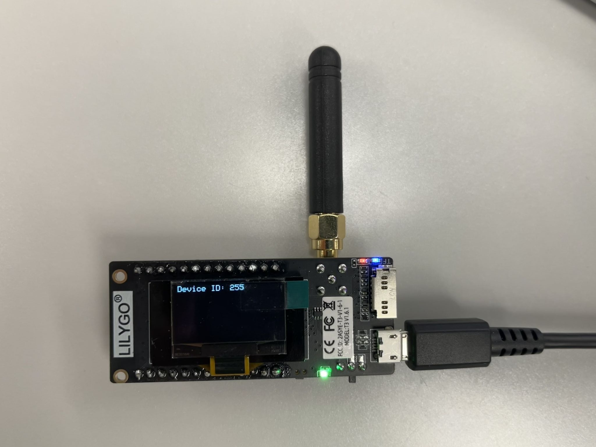
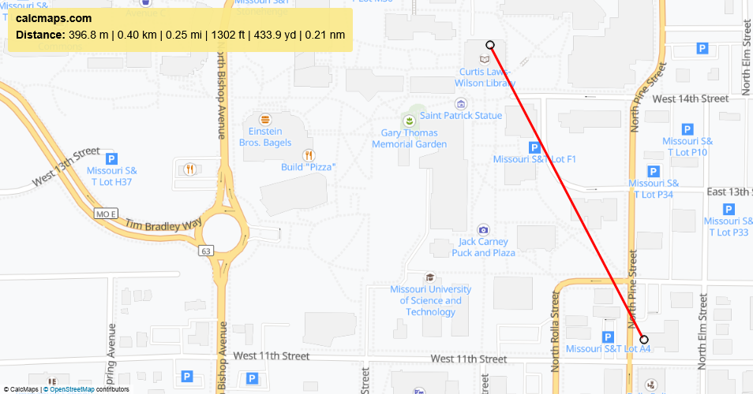
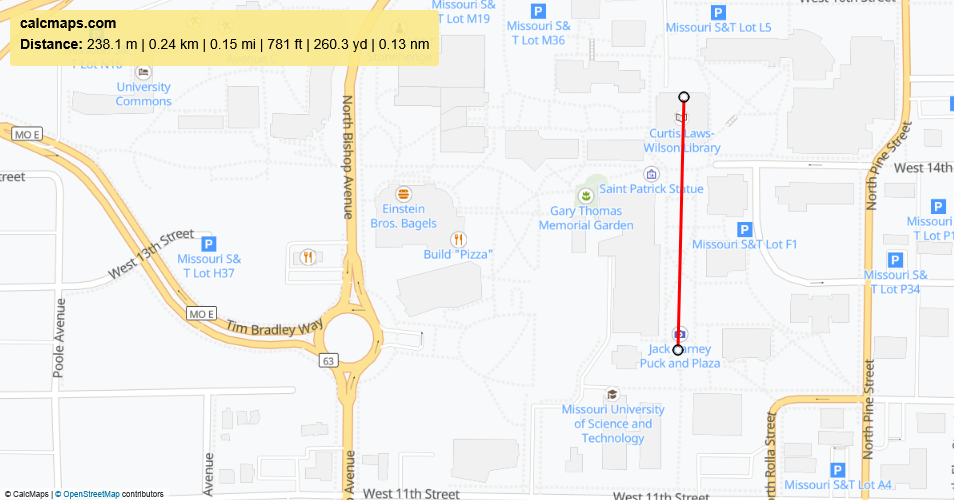

# LoComm Devices: Secure P2P Communication
*LoComm Devices are ESP32s with a LoRa module. The devices provides a low power solution for the secure transmission of data over 915 MHz radio. Providing long range but lower bandwidth. With the use of the computer API applications can be built to utilize the device’s functionality*

## Team Members
Ethan Kleine - ejkmvp@umsystem.edu
Abraham Yirga - aayfn7@umsystem.edu
Caleb Robinson - cmrd2d@umsystem.edu
Kush Solanki - kysp2d@umsystem.edu
Shaun Wolfe - swgw8@umsystem.edu
Arjun Kirubakaran - apkccy@umsystem.edu

## Problem Statement
In areas without reliable internet or cellular infrastructure, people, and IoT devices may face serious communication barriers. In these areas secure communication is still required, protecting sensitive or proprietary information. A low cost device that provides secure communication, where wireless infrastructure is not available is a need for these situations.

## Solution
This project provides a secure peer to peer communication system that operates without internet or cellular infrastructure. Using LoRa enabled ESP32 devices and a desktop application, users can exchange secure text messages, giving people a way to communicate privately and consistently. 

LILYGO LoRa32 915Mhz ESP32 Development Board OLED 0.96 Inch SD Card BLE WiFi
Cost: $30.00

## Device Security
The LoComm device is designed to maintain security in any remote environment regardless of available infrastructure.
- **Authentication** - Access to each LoComm device requires a user-set password.
- **Authorization** - The user-set password is required to determine the shared symmetric key used for encryption. 
- **Confidentiality** - Shared secret key encryption via AES-GCM
- **Integrity** - Shared secret key encryption via AES-GCM. Replay attacks are avoided with timestamped messages.
- **Reliability** - Message ACKs are used to verify messages were received, and messages are segmented to aid transmission success rate.

## Message Format
| Feild Name | Field Size |
| ----------- | ----------- |
| Start Byte | 1 Byte |
| 0 | 1 Byte |
| Sender ID (Encrypted) | 1 Byte |
| Receiver ID (Encrypted) | 1 Byte |
| Message Number (Encrypted) | 2 Bytes |
| Sequence Number (Encrypted) | 1 Byte |
| Sequence Count (Encrypted) | 1 Byte |
| Timestamp (Encrypted) | 4 Bytes |
| DATA (Encrypted) | N Bytes |
| Encryption Overhead (Encrypted) | 20 Bytes |
| CRC | 2 Bytes |
| End Byte | 1 Byte |

## Device API
The API consists of many functions to communicate with the device in Python.  These API functions can facilitate the connection form application to device, transmission of messages, pairing key handling, etc. 

## Desktop App
The desktop application is designed to be interactive and support secure peer to peer messaging over short range connections.

## Performance

Indoor to outdoor communication at a distance of 0.25 miles messages messages sent without issues. Indoor to indoor communication at 0.24 miles, the devices were not able to receive messages from each other

A test of 30 messages sent at a distance of 0.15 miles from outdoor to indoor resulted in zero dropped messages. There was 1 out of order message: 1, …, 27, 29, 30, 28.

## Conclusion
The LoComm Device works well in an outdoor environments. At shorter ranges, it can handle large obstacles blocking line-of-sight between devices. This device would work in a smart agriculture scenario, where there are large fields, and power consumption is a concern. Other applications of this device include in industrial warehouses, where low cost wireless communication is crucial, and the defense industry where a secure form of data transfer is critical.

## Future Work
Continued work on this project would introduce features including: frequency hopping to prevent jamming attacks, improved antennas for better bandwidth, in-order message delivery enforcement, to prevent out of order messages, and group ACKs for broadcasts.